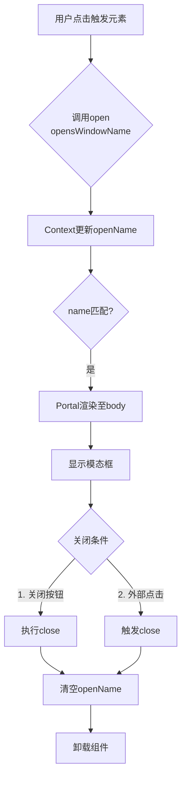

# How to fetch all rows using Supabase?
```js -> server/api
const {data, error} = await supabase.from('table_name').select('*');
```
We can use react-query optimize this fetch
```js -> query/useGetAll
import {useQuery} from '@tanstack/react-query';
import {getAll} from 'server/api'

export function useGetAll () {
    const {
        isPending,
        data,
        error,
    } = useQuery({
        queryKey: ["table_name"],
        queryFn: getAll,
    });

    return {isPending, data, error};
}
```

# How to insert new row in your tables
```js -> server/api
const {data, error} = await supabase
    .from('table_name')
    .insert([{some_column: 'someValue', other_column: 'otherValue'}])
    .select()
```
We can use react-query optimize this fetch
```js -> query/useCreate
import {useMutation, useQueryClient} from '@tanstack/react-query'
import {create} from 'server/api'

export function useCreate () {
    const {queryClient} = useQueryClient();
    
    const {mutate, isPending} = useMutation({
        mutationFn: create,
        onSuccess: () => {
            // the QueryClient has an invalidateQueries method that lets you intelligently mark queries as stale and potentially refetch them too!
            // Invalidate every query with a key that starts with `table_name`
            queryClient.invalidateQueries({queryKey: ['table_name']});
        },
        onError: (err) => console.error(err.message),
    });

    return {mutate, isPending}
}
```

# How to update rows
```js -> server/api

const {data, error} = await supabase
    .from('table_name')
    .update({other_column: 'otherValue'})
    .eq('some_column', 'someValue')
    .select()
    .single()
```


# How to upload images or files
```js -> server/api
const {data, error} = await supabase.storage
    .from("storage_name")
    .upload(`https://uhovqnjvlmtxdpxmetpp.supabase.co/storage/v1/s3/${file.name}`, file)
```

# How to create unique filename for images before uploading to supabase storage
```js -> server/api
const imageName = `${Math.random()}-${newData.image.name}`.replaceAll("/", "");

```

# Create combine Edit
1. Create/Edit Shared Form Functionality
```js -> server/api
let query = await supabase.from("table_name");

if (!id) query = query.insert([{some_column: "some_value", other_column: "other_value"}]);
if (id) query = query.update([{other_column: "other_column"}]).eq('id', id);

const {data, error} = await query.select().single();

```
2. Form Populating
```jsx -> src/CreateForm
import {useForm} from 'react-hook-form';
const {register} = useForm({
    defaultValues: isEditSession ? editValue : {};
})
```

3. Partial Update - image
```jsx -> src/CreateForm
<input 
    id="image" 
    type="file" 
    accept="image/*" 
    {...register("image", {
        require: isEditSession ? false : "This filed is required",
    })}
    />
```
```jsx -> src/CreateForm
// data.image === 'string' ? Existing : New
const imageSrc = typeof data.image === 'string' ? data.image : data.image[0];
```
```js -> src/api
// hasImagePath
// true-> return exiting image
// false-> upload new image to the storage
```

4. if upload fail
```js -> server/api
const {error: storageError} = await supabase.storage
    .from("buckets_name")
    .upload(imageName, newData.image);

if (storageError) {
    await supabase.from("table_name").delete().eq("id", data.id);
    console.error(storageError);
    throw new Error(
        "Image could not be uploaded and the row was not created"
    )
}
```



```
react query v5 {isPending} status and flag have been renamed to {isPending}
```

/*
materials

Name            Format                   Type     Description
id              bigint                   number   
created_at      timestamp with time zone string   
item_name       text                     string   
position        text                     string   
description     text                     string   
item_status     text                     string   
item_quantity   smallint                 number


*/

styles:

bg-stone-50 dark:bg-stone-950 
text-slate-950 dark:text-slate-200
border-stone-200 dark:border-stone-900

hover:bg-gray-200 dark:hover:bg-neutral-800/70


# Vite Environment Variables

```env
.env                # Base (all environments)
.env.local          # Local overrides (gitignored)
.env.[mode]         # Stage-specific (e.g., .env.development)
.env.[mode].local   # Stage-specific local overrides


import.meta.env.MODE      // 'development', 'production'
import.meta.env.DEV       // boolean (true in dev)
import.meta.env.PROD      // boolean (true in prod)
import.meta.env.BASE_URL  // from vite.config.js base option


# .env.development
VITE_API_URL=http://localhost:3000
VITE_DEBUG=true

# .env.production  
VITE_API_URL=https://api.example.com
VITE_DEBUG=false


// Access in code
const apiUrl = import.meta.env.VITE_API_URL
const isDebug = import.meta.env.VITE_DEBUG


Configuration Options

// vite.config.js
export default defineConfig({
  envPrefix: ['VITE_', 'APP_'], // Custom prefixes
  define: {
    // Inject static values at build time
    '__APP_VERSION__': JSON.stringify('1.0.0')
  }
})

```

# Vite Image & Media Asset Optimization Summary

Advanced Optimization Plugins

- vite-plugin-imagemin: Automatically compresses images and converts formats (e.g., to WebP/AVIF) during build.
- vite-plugin-picture: (Emerging) Automates responsive image markup generation.